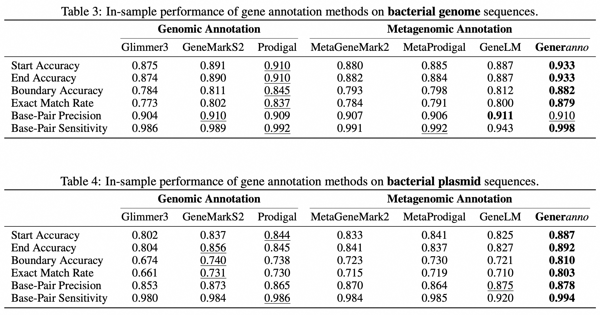
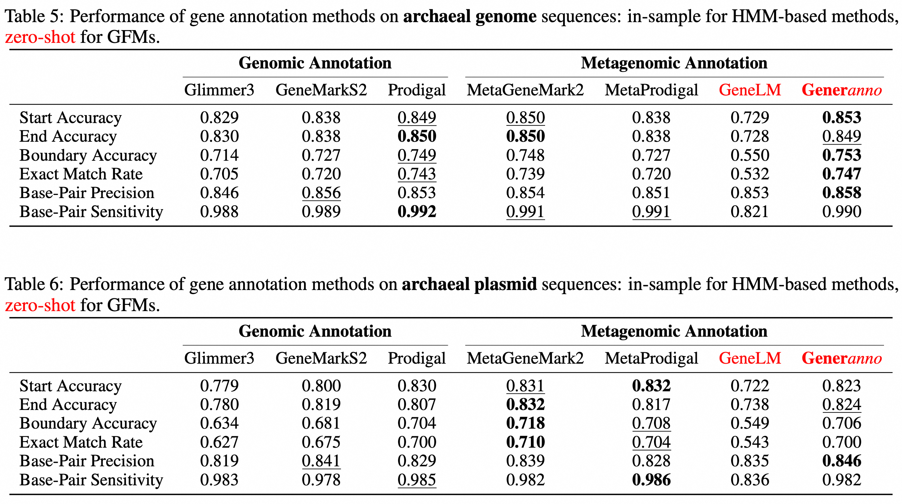

<p align="center">
  <picture>
    
  </picture>
</p>

<h1 align="center">GENERanno: A Genomic Foundation Model for Metagenomics Annotation</h1>

## 📰 News

* 🤗 **[2025-02-11]** We are pleased to announce that our models `GENERanno-prokaryote-0.5b-base`,
  `GENERanno-eukaryote-0.5b-base` are now available on [Hugging Face](https://huggingface.co/GenerTeam/)!

## 🔭 Overview

In this repository, we present GENERanno, a genomic foundation model featuring a context length of 8k base pairs and
500M parameters, trained on an expansive dataset comprising 386 billion base pairs of eukaryotic DNA. Our evaluations
demonstrate that the GENERanno achieves comparable performance
with [GENERator](https://huggingface.co/GenerTeam/GENERator-eukaryote-1.2b-base) in benchmark evaluations,
including [Genomic Benchmarks](https://huggingface.co/datasets/katielink/genomic-benchmarks/tree/main), [NT tasks](https://huggingface.co/datasets/InstaDeepAI/nucleotide_transformer_downstream_tasks_revised),
and our newly proposed [Gener tasks](https://huggingface.co/GenerTeam), making them the top genomic foundation models in
the field (2025-02).

Beyond benchmark performance, the GENERanno model is meticulously designed with its specialization in gene annotation.
The model efficiently and accurately identifies gene locations, predicts gene function, and annotates gene structure,
highlighting its potential to revolutionize genomic research by significantly enhancing the precision and efficiency of
gene annotation processes.

Please note that the GENERanno is currently in the developmental phase. We are actively refining the model and will
release more technical details soon. Stay tuned for updates!

In this repository, you will find the following model checkpoints:

| Model Name                       | Parameters | Data |     Category     |                    Status                     |
|----------------------------------|:----------:|:----:|:----------------:|:---------------------------------------------:|
| `GENERanno-eukaryote-0.5b-base`  |    0.5B    | 386B |    Eukaryote     | [Available](https://huggingface.co/GenerTeam) |
| `GENERanno-prokaryote-0.5b-base` |    0.5B    | 715B |    Prokaryote    | [Available](https://huggingface.co/GenerTeam) |
| `GENERanno-eukaryote-1b-base`    |     1B     | 386B |    Eukaryote     |             Awaiting sponsorship              |
| `GENERanno-prokaryote-1b-base`   |     1B     | 715B |    Prokaryote    |             Awaiting sponsorship              |

## 📈 Benchmark Performance

### Coding DNA Sequence (CDS) Annotation



### Sequence Understanding (Classification/Regression)


## 🎯 Quick Start

### Dependencies

* Clone this repo, cd into it

```shell
git clone https://github.com/GenerTeam/GENERanno.git
cd GENERanno
```

* Install requirements with Python 3.10

```shell
pip install -r requirements.txt
```

> If your network cannot access huggingface.co normally, we recommend using the following command to use a mirror:
> ```shell
> export HF_ENDPOINT=https://hf-mirror.com
> ```

### Pre-train

coming soon...

### Downstream

#### Coding DNA Sequence (CDS) Annotation

To run the coding sequence annotation task on
our [cds annotation dataset](https://huggingface.co/datasets/GenerTeam/cds-annotation/), you can use the
following command:

```shell
# Using single GPU
python src/tasks/downstream/cds_annotation.py

# Using multiple GPUs (Data Parallel)
python src/tasks/downstream/cds_annotation.py --dp_size ${NUM_GPUS}
```

#### Sequence Understanding (Classification/Regression)

To run the sequence understanding task
on [Gener Tasks](https://huggingface.co/datasets/GenerTeam/gener-tasks), [Prokaryotic Gener Tasks](https://huggingface.co/datasets/GenerTeam/prokaryotic-gener-tasks), [NT Tasks](https://huggingface.co/datasets/InstaDeepAI/nucleotide_transformer_downstream_tasks_revised), [Genomic Benchmarks](https://huggingface.co/katarinagresova), [DeepSTARR Enhancer](https://huggingface.co/datasets/GenerTeam/DeepSTARR-enhancer-activity),
you can use the following arguments:

* Gener Tasks / Prokaryotic Gener Tasks
    * `--dataset_name GenerTeam/gener-tasks` or `--dataset_name GenerTeam/prokaryotic-gener-tasks`
    * `--subset_name gene_classification` or `--subset_name taxonomic_classification` or ...
* NT Tasks
    * `--dataset_name InstaDeepAI/nucleotide_transformer_downstream_tasks_revised`
    * `--subset_name H2AFZ` or `--subset_name H3K27ac` or ...
* Genomic Benchmarks
    * `--dataset_name katarinagresova/Genomic_Benchmarks_demo_human_or_worm` or
      `--dataset_name katarinagresova/Genomic_Benchmarks_human_ocr_ensembl` or ...
* DeepSTARR Enhancer Activity
    * `--dataset_name GenerTeam/DeepSTARR-enhancer-activity`
    * `--problem_type regression`

on following command:

```shell
# Using single GPU
python src/tasks/downstream/sequence_understanding.py \
    --model_name GenerTeam/GENERator-eukaryote-1.2b-base \
    --dataset_name ${DATASET_NAME} \
    --subset_name ${SUBSET_NAME} \
    --batch_size ${BATCH_SIZE} \
    --problem_type ${PROBLEM_TYPE} \
    --main_metrics ${MAIN_METRICS}

# Using multiple GPUs on single node (DDP)
torchrun --nnodes=1 \
    --nproc_per_node=${NUM_GPUS} \
    --rdzv_backend=c10d \
    src/tasks/downstream/sequence_understanding.py

# Using multiple GPUs on multiple nodes (DDP)
torchrun --nnodes=${NUM_NODES} \
    --nproc_per_node=${NUM_GPUS_PER_NODE} \
    --rdzv_backend=c10d \
    --rdzv_endpoint=${MASTER_ADDR}:${MASTER_PORT} \
    src/tasks/downstream/sequence_understanding.py

# Using DeepSpeed or Full Sharded Data Parallel (FSDP)
torchrun --nnodes=${NUM_NODES} \
    --nproc_per_node=${NUM_GPUS_PER_NODE} \
    --rdzv_backend=c10d \
    --rdzv_endpoint=${MASTER_ADDR}:${MASTER_PORT} \
    src/tasks/downstream/sequence_understanding.py \
    --distributed_type deepspeed # or fsdp
```

## 📚 Datasets

coming soon...

## 📜 Citation

```
@misc{wu2025generator,
      title={GENERator: A Long-Context Generative Genomic Foundation Model}, 
      author={Wei Wu and Qiuyi Li and Mingyang Li and Kun Fu and Fuli Feng and Jieping Ye and Hui Xiong and Zheng Wang},
      year={2025},
      eprint={2502.07272},
      archivePrefix={arXiv},
      primaryClass={cs.CL},
      url={https://arxiv.org/abs/2502.07272}, 
}
```
